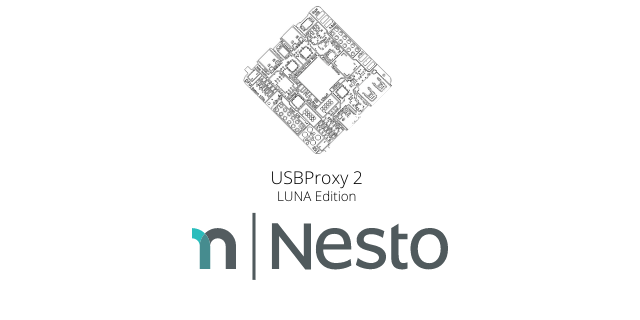

USB Proxy v2 [LUNA Edition] for Raspberry Pi (armhf)   
========

  

We are currently trying to implement <a href="https://github.com/nesto-software/USBProxy">USBProxy</a> functionality using the LUNA board.